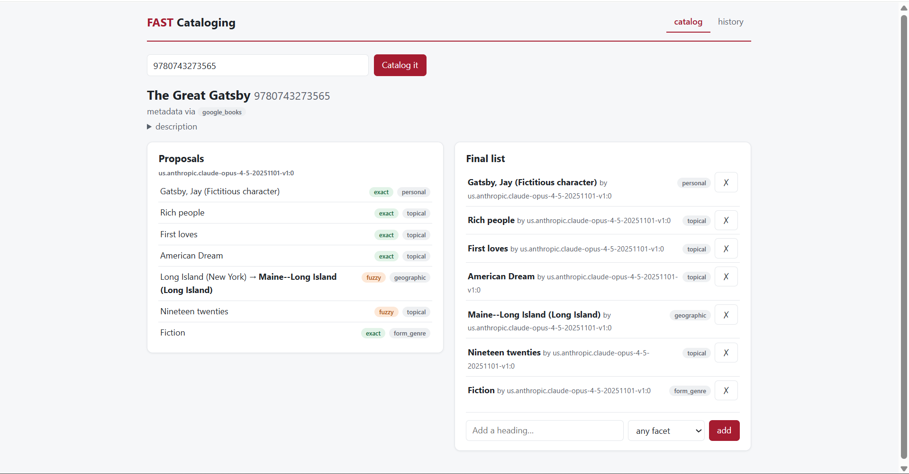

# FAST Cataloging

A web application that automates library subject cataloging: paste a book's
ISBN and get authorized **FAST subject headings** ([Faceted Application of
Subject Terminology](https://www.oclc.org/en/fast.html)) proposed by an LLM,
validated against the real controlled vocabulary, and finished by a human
reviewer. Built for a cataloging workflow at Harvard Library.



## Why this exists

Assigning subject headings is skilled, repetitive work: find the book's
metadata, decide what it's about, and express that in controlled vocabulary.
Exact authorized strings like `Nineteen twenties` or `Gatsby, Jay (Fictitious
character)`, each with a permanent FAST ID. LLMs are good at the "what is this
book about" step but unreliable at the "exact authorized string" step: they
invent plausible headings that don't exist, compound forms that aren't
searchable, and IDs that are pure fiction.

This project's core idea: **let the model propose, let the vocabulary
authorize, let the human decide**, and record the evidence for every step.

## How it works

```
ISBN
 │  validate & normalize (ISBN-10 → ISBN-13)
 ▼
metadata waterfall        Google Books → Open Library (edition, then parent
 │                        work) → web search (Tavily) distilled by an LLM
 │                        with a wrong-book guard; provenance recorded
 ▼
candidate generation      Claude (via an institutional AWS Bedrock gateway)
 │                        with schema-enforced output: label + facet per
 │                        heading, via forced tool use
 ▼
reconciliation            every label checked against OCLC's assignFAST API;
 │                        facet-scoped indexes + a rescue ladder (qualifier
 │                        stripping, compound truncation, cross-facet retry);
 │                        every match graded by trust tier
 ▼
review UI                 per-model proposals with tier badges, a computed
                          final list, reject/undo/add. Human decisions are
                          stored as data, never as edits
```

### The trust-tier system

No heading reaches a reviewer without a label saying how it was matched:

| tier | meaning |
|---|---|
| `exact` | the model's label **is** the authorized heading |
| `variant` | matched a see-from cross-reference (the vocabulary's designed redirection) |
| `truncated` | authorized only after chopping unsearchable `--` subdivisions |
| `fuzzy` | nearest suggestion, possibly cross-facet. Review with suspicion |
| `no_match` | not in the vocabulary. For human judgment (or a gap in FAST itself) |

The review screen color-codes these, so a reviewer's eye lands on the rows
that need attention before reading a word.

### Design principles

- **Evidence over edits**  headings, decisions, and runs are append-only
  rows; the "final list" is computed from the ledger, never stored.
- **Fail soft, fail honestly**  a flaky external service degrades one
  heading or one run, never a batch; every failure is recorded with its story.
- **Trust boundaries are guarded**  external API responses, LLM output, and
  user input are all normalized/validated at the door; internal code stays lean.
- **Provenance everywhere**  every description says which source supplied it
  (web-sourced metadata gets a "verify against the book in hand" warning);
  every heading says which model proposed it and how it was authorized.

## Running it

```bash
# backend
python -m venv .venv && source .venv/Scripts/activate
pip install fastapi "uvicorn[standard]" sqlalchemy psycopg2-binary \
            pydantic-settings requests pytest httpx
cp .env.example .env          # fill in your values
python -c "from app.db import Base, engine; import app.models; Base.metadata.create_all(engine)"
uvicorn app.main:app --reload --port 8000

# frontend (separate terminal)
cd frontend
npm install
npm run dev                   # http://localhost:5173 (proxies /api to :8000)
```

Requires a PostgreSQL database (any install; `DATABASE_URL` points at it) and
the API credentials described in [.env.example](.env.example). Without the
optional keys the pipeline degrades gracefully (fewer metadata sources).
